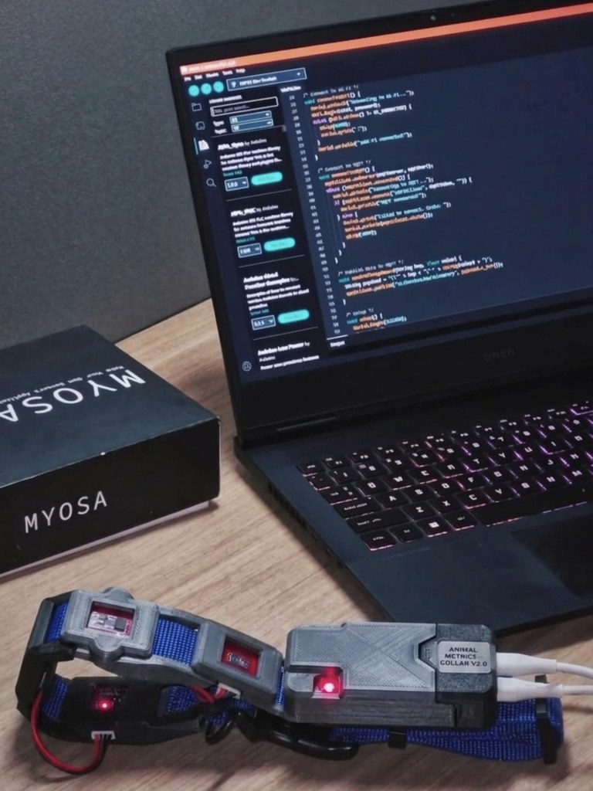

# Smart Herd Edge: On-Collar Intelligence for Livestock Monitoring with MYOSA

Blog submission for **IEEE SENSORS@25** (MYOSA).

| File | Description |
|---|---|
| [`myosa-smart-herd-edge/myosa-smart-herd-edge.md`](myosa-smart-herd-edge/myosa-smart-herd-edge.md) | Blog (MYOSA submission format) |
| [`myosa-smart-herd-edge/myosa-smart-herd-edge-demo.mp4`](myosa-smart-herd-edge/myosa-smart-herd-edge-demo.mp4) | Demo video |
| [`myosa-smart-herd-edge/firmware/`](myosa-smart-herd-edge/firmware) | MYOSA collar firmware and unit tests |
| [`myosa-smart-herd-edge/analytics/`](myosa-smart-herd-edge/analytics) | Field-data audit, bench scenario and figures |
| [`myosa-smart-herd-edge/dataset/`](myosa-smart-herd-edge/dataset) | Raw v2 field-trial log |

  

