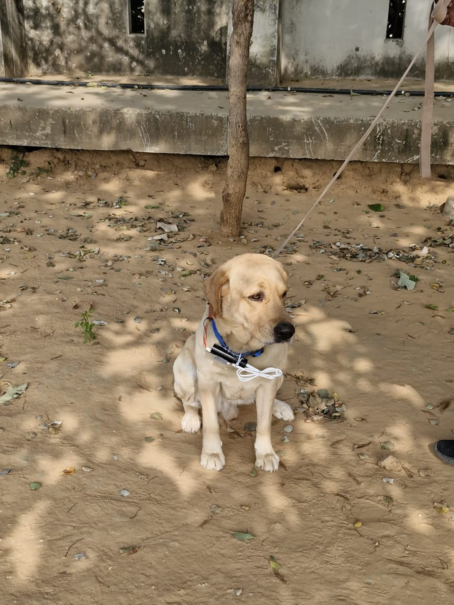
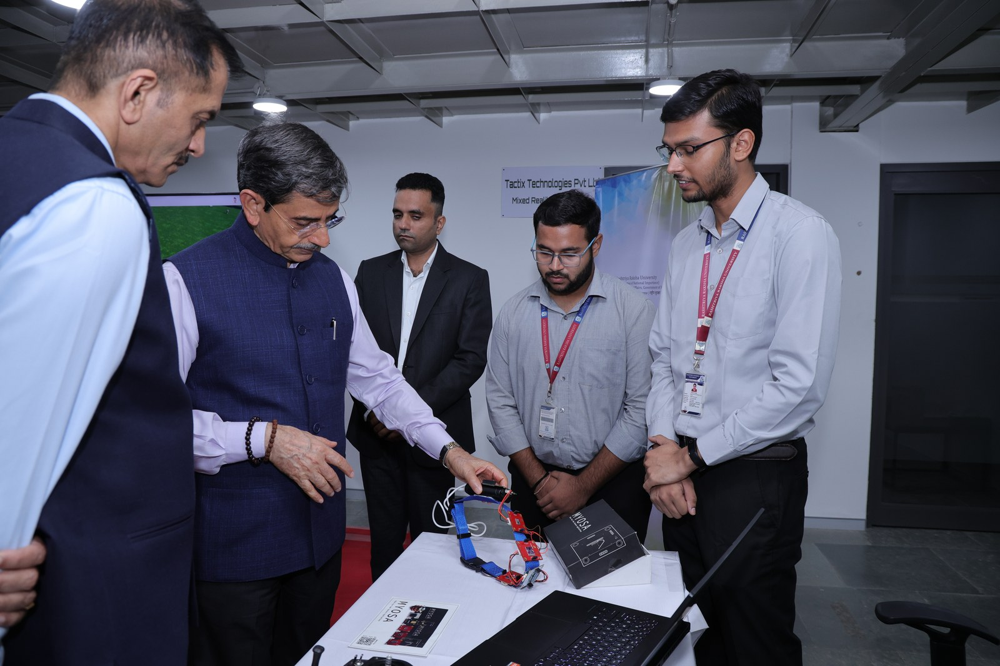
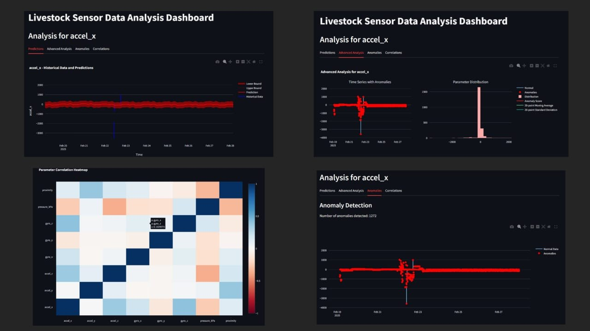
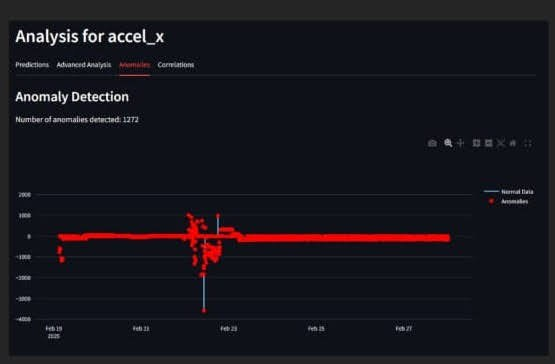
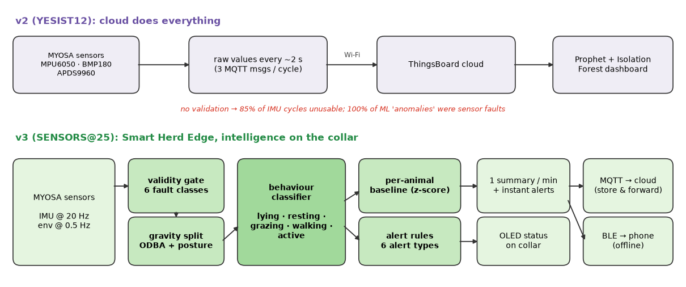
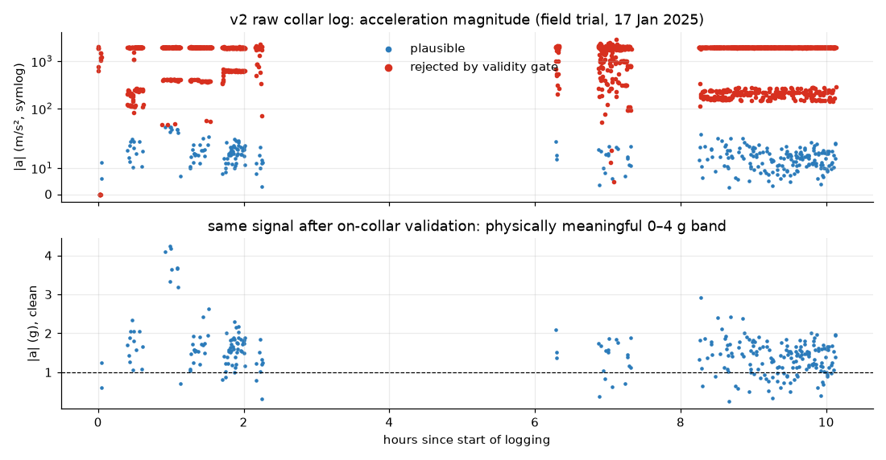
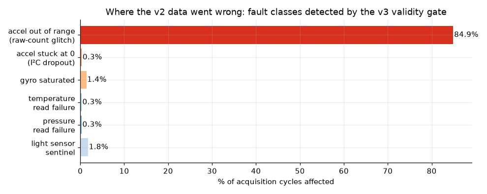
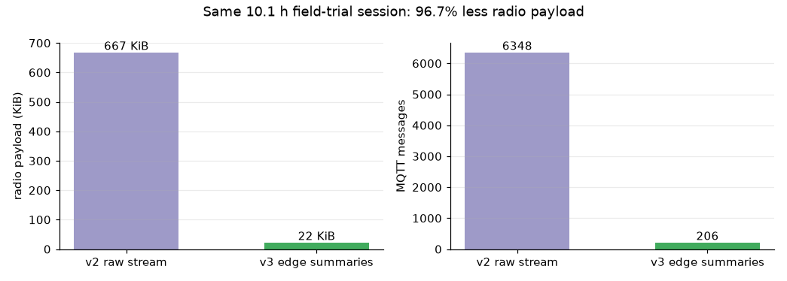
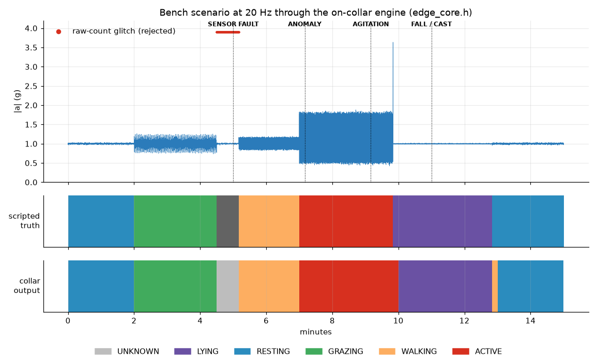

> A MYOSA smart collar that checks its own data, understands what the animal is doing, and only speaks up when something matters.

---

## Acknowledgements

Smart Herd Edge is built entirely on the **MYOSA** (Make Your Own Sensor Application) kit from the **IEEE Sensors Council**. We thank the **MYOSA Sensors Council** for the platform, the mentorship and the invitation to take this work to **IEEE SENSORS@25**.

This is an **upgrade of our earlier MYOSA project, Smart Herd**. The original blog is on the official MYOSA website: **[Smart Herd: Revolutionizing Livestock Monitoring with MYOSA](https://blog.myosa-sensors.org/)**.

We are also grateful to **Rashtriya Raksha University (RRU)** and its Sensors Council, where the v2 collar was field-tested on working animals, and to the animals' trainer, whose feedback shaped the goals of this version. As the invitation requires, everything here uses **the same MYOSA hardware kit we received earlier**. No new hardware was added.

---

## Overview

**What it does.** Smart Herd Edge is a collar for cattle and other working animals, built on the MYOSA ESP32 motherboard with the kit's MPU6050 accelerometer/gyroscope, BMP180 pressure/temperature sensor, APDS9960 light/proximity sensor and 0.96" OLED. It measures movement, posture and microclimate, works out on the collar whether the animal is **lying, resting, grazing, walking or highly active**, and raises **alerts** for inactivity, falls, agitation, heat stress, unusual behaviour and sensor faults.

**Who it is for.** Small and mid-scale livestock farmers, and handlers of working animals, who need continuous monitoring at a price and complexity they can manage. These users often have weak connectivity in the field and no time to read raw sensor charts.

**What problem it solves.** Health problems in livestock (lameness, illness, heat stress, injury) usually show up first as **changes in behaviour**: less time grazing, more time lying, restlessness. A farmer walking the herd once or twice a day sees these changes late. Our v2 Smart Herd collar streamed raw sensor values to the cloud, and a dashboard tried to interpret them afterwards. When we audited our own v2 field data for this submission, we found a much more basic problem: **most of the raw data was physically impossible** (details below). In v2, none of it was checked before reaching the ML models.

**How it works.** The v3 firmware runs a small, deterministic signal-processing pipeline on the ESP32:

1. a **validity gate** rejects impossible readings at the source (six fault classes);
2. the IMU signal, sampled at **20 Hz**, is split into **gravity** (posture) and **dynamic acceleration** (activity, ODBA);
3. a **behaviour classifier** labels every 10-second window;
4. a **per-animal baseline** learns what "normal" looks like for this animal;
5. an **alert engine** turns sustained patterns into specific, actionable alerts;
6. the collar sends **one compact summary per minute** (plus instant alerts) over Wi-Fi/MQTT and BLE, and buffers data while offline.

### What's new since our previous MYOSA blog (v2 → v3)

| Area | v2 (previous submission) | v3: Smart Herd Edge (this submission) |
|---|---|---|
| Where data is interpreted | Cloud dashboard only | **On the collar** (ESP32), the cloud is optional |
| Data validation | None | **6-class validity gate** on every sample |
| IMU sampling | One reading per ~6 s cycle | **20 Hz** with a 21 Hz on-chip low-pass filter |
| Behaviour | Not inferred | **Lying / resting / grazing / walking / active** |
| Anomaly detection | Isolation Forest on raw values | **Per-animal EWMA baseline** on validated activity |
| Alerts | Rule ideas in the dashboard | **6 alert types** on-device, latched and de-duplicated |
| Radio traffic | 3 MQTT messages per cycle, full key names | **1 summary per minute**: **96.7% less payload** |
| Offline operation | Data lost without Wi-Fi | **Store-and-forward** (3 h buffer) + BLE |
| Data-quality reporting | None | Quality score `q` in every message + **SENSOR FAULT** alert |
| Verification | Manual | **31 host unit tests**, firmware **compiled for ESP32**, full replay of field data |

**Key features:**
* Edge-first design: the collar keeps working and alerting with no internet at all
* Self-diagnosing sensing: the collar reports when its own data cannot be trusted
* Behaviour time budgets (minutes lying, resting, grazing, walking, active), a well-established welfare indicator in livestock research
* Six concrete alerts a farmer can act on, without reading a chart
* Uses only the existing MYOSA kit and open-source Arduino libraries
* Fully reproducible: every number in this blog is produced by scripts in this repository

---

## Demo / Examples

### Images

<p align="center">
  <br/>
  <i>The Smart Herd collar hardware: MYOSA sensor boards in 3D-printed housings on the collar strap, next to the MYOSA kit box and the development laptop.</i>
</p>

<p align="center">
  <br/>
  <i>The v2 collar worn by a working dog during our field trial with Rashtriya Raksha University. The data recorded in this trial is what we audited for v3.</i>
</p>

<p align="center">
  <br/>
  <i>Close-up of the collar prototype and MYOSA kit, demonstrated during the Honourable Governor of Tamil Nadu's visit to RRU.</i>
</p>

<p align="center">
  <br/>
  <i>Presenting Smart Herd to visiting faculty and officials after its showcase at IEEE APSCON 2025, IIT Hyderabad.</i>
</p>

<p align="center">
  <br/>
  <i>The v2 analytics dashboard (Streamlit): Prophet forecasts, Isolation Forest anomalies and a correlation heatmap, all computed on unvalidated raw data.</i>
</p>

<p align="center">
  <br/>
  <i>The v2 anomaly view, which flagged 1,272 "anomalies" in accel_x. Our v3 audit shows that such flags were sensor faults, not animal behaviour.</i>
</p>

<p align="center">
  <br/>
  <i>v2 vs v3 architecture. In v3 the full chain from validation to alerts runs on the MYOSA ESP32 collar.</i>
</p>

### Videos

<video controls width="100%">
  <source src="./myosa-smart-herd-edge-demo.mp4" type="video/mp4">
</video>

▶️ [Watch / download the demo video (myosa-smart-herd-edge-demo.mp4)](./myosa-smart-herd-edge-demo.mp4)

*The 100-second demo walks through the v2 collar in the field, the audit of the real field-trial data, the v3 architecture, the edge engine running live (signal, scripted ground truth, collar output, simulated OLED view and the minute-by-minute uplink log) and the measured results. Every trace and number in the video is generated from this repository's data by `tools/make_demo_video.py`.*

---

## Features (Detailed)

### **1. We audited our own field data first**

Before designing anything new, we re-examined the **10.1-hour continuous log (17 January 2025, 12,796 raw rows)** recorded by the v2 collar and exported from ThingsBoard (`dataset/field-trial-2025-01-17.csv`). The v2 firmware published each sensor group as a separate MQTT message, so `analytics/data_audit.py` first re-assembles the rows into **2,116 acquisition cycles** (6-second bins). It then checks every cycle against physical limits.

The result changed our whole plan:

* **85.4%** of IMU cycles contain at least one acceleration axis outside **±4 g** (39.2 m/s²), a limit no collar on a walking or grazing animal can sustain. Values reach **3,580 m/s²**.
* `accel_y` alone is out of range in **58.6%** of cycles, sitting in two tight clusters near **±1,930**. That pattern points to a systematic acquisition error (register or scaling) in the v2 firmware, not to animal motion.
* We also found **I²C dropouts** (all three axes exactly 0 with frozen tilt values), **gyro saturation** at ±500 °/s, failed BMP180 reads (0 °C / 491 °F / 0 kPa) and a repeating APDS9960 sentinel value (37,889).
* We re-ran the v2 dashboard's own detector (Isolation Forest on `accel_x`, contamination 0.1). **All 208 of its 208 "anomalies"** have an `accel_x` value outside ±4 g. The v2 ML layer was detecting broken readings, not sick animals.

<p align="center">
  <br/>
  <i>Top: raw v2 acceleration magnitude (symlog scale). Red points fail the validity gate. Bottom: what remains after validation.</i>
</p>

<p align="center">
  <br/>
  <i>Fault classes in the v2 log, as a percentage of acquisition cycles.</i>
</p>

**Takeaway for v3:** you cannot fix data in the cloud that never made physical sense. Validation has to happen **at the sensor**, and every downstream number has to carry a data-quality score.

### **2. On-collar validity gate**

Every sample passes through `EdgeEngine::validate()` before it is used. The same limits are used in the Python audit, so the field analysis and the firmware agree exactly.

| Fault class | Rule (per sample) | Seen in v2 log |
|---|---|---|
| Accel out of range | any axis \|a\| > 4 g | 84.9% of cycles |
| Accel dropout | all axes exactly 0, or missing | 0.3% |
| Gyro saturated | any axis ≥ 500 °/s, or missing | 1.4% |
| Temperature failure | 0 °C or outside −10…50 °C | 0.3% |
| Pressure failure | outside 80…110 kPa | 0.3% |
| Light sentinel | APDS9960 returns 37,889 | 1.8% |

Rejected IMU samples never reach the classifier. If more than half the samples in a window are invalid, the window is labelled **UNKNOWN** rather than guessed. Three such windows in a row raise a **SENSOR FAULT** alert, so the farmer learns that the collar needs attention instead of receiving false health alerts. In v3 the MPU6050 is also explicitly configured to **±4 g / ±500 °/s with a 21 Hz digital low-pass filter**, matching the gate and preventing aliasing at 20 Hz.

### **3. Gravity separation, activity (ODBA) and posture**

The accelerometer measures gravity and motion together. The firmware separates them with a first-order low-pass filter (time constant τ = 2 s):

```plaintext
g[n]    = g[n-1] + α·(a[n] − g[n-1]),      α = Δt / (τ + Δt)
dyn[n]  = a[n] − g[n]
ODBA[n] = (|dyn_x| + |dyn_y| + |dyn_z|) / 9.81          (in g)
posture = angle between mean g over the window and the "standing" reference
```

* **ODBA** (overall dynamic body acceleration) is a standard activity proxy in animal bio-logging. We average it over each 10 s window.
* **Posture** uses a standing reference vector captured when the collar is fitted (re-capture at any time with the `c` serial command). A head-down grazing posture tilts the collar by roughly 25–60°. Lying, with the neck turned or resting on the ground, rotates it further.
* Data gaps longer than 30 s (radio or power loss) close the current window and reset the gravity estimate, so a gap is never counted as time spent in any behaviour.

### **4. Behaviour classifier**

Each 10 s window is labelled with a transparent decision rule that is cheap enough to run on any microcontroller and easy to calibrate per animal:

| ODBA (g) | Posture | State |
|---|---|---|
| < 0.05 | ≥ 60° | **LYING** |
| < 0.05 | < 60° | **RESTING** (standing, ruminating) |
| 0.05 – 0.35 | ≥ 25° | **GRAZING** (head down, moving slowly) |
| 0.05 – 0.35 | < 25° | **WALKING** |
| ≥ 0.35 | any | **ACTIVE** (running, agitation, mounting) |

These are **starting thresholds**, exposed in `herd::Config`. Calibrating them per species and per animal with video-labelled data is the core of our validation plan for SENSORS@25 (see section 9).

### **5. Per-animal baseline (lightweight anomaly detection)**

Instead of running Isolation Forest in the cloud on raw values, the collar keeps an **exponentially weighted mean and variance** of its own validated activity:

```plaintext
μ ← μ + α·(x − μ)
σ² ← (1 − α)·(σ² + α·(x − μ)²)          α = 0.02, 30-window warm-up
z = (x − μ) / σ                          ANOMALY alert when |z| ≥ 4
```

This costs a few bytes of RAM and a handful of floating-point operations per window. Because it only ever sees validated data, it flags changes in behaviour rather than sensor glitches.

### **6. Alert engine**

| Alert | Trigger (defaults, configurable) | Why it matters |
|---|---|---|
| **INACTIVITY** | resting/lying continuously ≥ 4 h | possible illness, lameness or injury |
| **FALL / CAST** | impact > 2.5 g, then lying with no movement for 60 s | an animal stuck on its back or side needs help fast |
| **AGITATION** | ACTIVE continuously ≥ 2 min | stress, predator, oestrus or escape |
| **HEAT STRESS** | collar temperature ≥ 32 °C for ≥ 10 min | heat load reduces welfare and productivity |
| **ANOMALY** | activity z-score ≥ 4 vs. the animal's own baseline | unusual behaviour worth a look |
| **SENSOR FAULT** | ≥ 50% invalid samples in 3 consecutive windows | the collar itself needs attention |

Alerts are **latched**: each one fires once when its condition becomes true and re-arms only after the condition clears, so the farmer isn't flooded with repeats. Alerts are sent immediately over MQTT and BLE, shown on the OLED, and never dropped. If the collar is offline they go into the store-and-forward buffer.

### **7. Minute summaries, store-and-forward and BLE**

In normal operation the collar sends a single ~110-byte JSON summary per minute:

```plaintext
{"st":"GRAZING","act":0.200,"pk":1.26,"tC":24.3,"p":100.95,"q":1.00,
 "ly":0,"rs":0,"gz":60,"wk":0,"ac":0,"al":0}
```

`st` is the dominant state, `act` the mean ODBA, `pk` the peak |a|, `q` the fraction of valid samples, and `ly`/`rs`/`gz`/`wk`/`ac` the seconds spent in each behaviour (a ready-made **daily time budget**). `al` is a bitmask of the alerts raised that minute.

* **ThingsBoard over MQTT**: if NTP time is available, messages carry their original timestamp (`{"ts":…,"values":…}`), so buffered data lands at the right place on the timeline.
* **Store-and-forward**: 180 summaries (3 hours) are kept in RAM while Wi-Fi is down and flushed oldest-first on reconnect.
* **BLE**: the same payloads are notified on a Nordic-UART-style service, readable with any BLE terminal app (or our companion app) with no internet.
* **OLED**: the collar shows its current state, activity, temperature, connectivity (`W`/`B`) and any active alert.

Replaying the full field-trial log through the firmware's engine (`firmware/test/replay.cpp`) gives the radio comparison for **the same 10.1 h session**:

<p align="center">
  <br/>
  <i>v2 sent 6,348 MQTT messages (667 KiB). v3 sends 206 minute summaries (22 KiB): 96.7% less radio payload, which directly reduces radio-on time and power draw.</i>
</p>

In the same replay, **217 of 220** one-minute windows come out **UNKNOWN** and a **SENSOR FAULT** alert is raised. That is the correct behaviour on data that is 85% invalid: v3 says "I can't tell" instead of inventing behaviour, which is exactly what v2 could not do.

### **8. Bench validation of the edge engine**

The v2 data can't validate behaviour classification: it is mostly invalid and sampled only once per ~6 s. So we verified the engine with a scripted **15-minute, 20 Hz bench scenario** with known ground truth: rest → grazing (head down 40°) → a burst of the exact v2 ±1,930 glitch → walking → running → a 3.5 g impact → lying motionless → rest. The scenario runs through the **identical C++ code** that is compiled into the firmware.

<p align="center">
  <br/>
  <i>Bench scenario: signal (top), scripted truth (middle), collar output (bottom). The engine raises SENSOR FAULT during the glitch burst, ANOMALY at the onset of running, AGITATION after 2 min of running, and FALL / CAST 60 s after the impact.</i>
</p>

* **85 of 87** scored windows (**97.7%**) match the scripted truth. The two misses are transition windows right after a posture change (impact → lying, lying → standing), where the 2 s gravity filter is still settling and briefly reads the posture change as motion.
* All four alerts in the script fire at the expected times; no unexpected alerts fire.
* **31/31 host unit tests** pass (`firmware/test/test_edge_core.cpp`). They cover every fault class, all five states, all six alert types and the summary payload.
* The complete sketch **compiles for the ESP32** (ESP32 Arduino core 2.0.17): **1,252,001 bytes of flash (39%)** and **80,588 bytes of RAM (24%)** with Wi-Fi, MQTT, BLE and the OLED all enabled.

These are **engineering checks on synthetic signals**, not field accuracy. We report them as such.

### **9. Limitations and validation plan for SENSORS@25**

We would rather be precise than impressive:

* Behaviour thresholds are physics-based starting values, not yet calibrated on labelled animal data.
* Collar temperature (BMP180) measures the microclimate at the collar, not core body temperature. The heat-stress alert is an environmental-exposure alert.
* The bench scenario shows that the logic is correct, not how well it generalises across animals.

**Plan (same MYOSA kit):** flash v3 onto the existing collar → repeat the field trial with 20 Hz on-collar features → record synchronized video and label behaviour → tune thresholds per species → report per-state precision/recall, daily lying-time budgets and alert precision at SENSORS@25.

---

## Usage Instructions

All paths and commands below are relative to the `myosa-smart-herd-edge/` project folder.

**1. Configure and flash the collar (Arduino IDE 2.x)**

```plaintext
1. Install the "esp32" board package (Espressif, 2.0.x) in Boards Manager
2. Install libraries: Adafruit MPU6050, Adafruit BMP085 Library, Adafruit SSD1306,
   Adafruit GFX Library, SparkFun APDS9960 RGB and Gesture Sensor, PubSubClient
3. Open firmware/smart_herd_edge/smart_herd_edge.ino
4. Edit config.h: Wi-Fi SSID/password and ThingsBoard device token
   (leave WIFI_SSID empty for BLE-only operation)
5. Tools → Board: "ESP32 Dev Module", Partition Scheme: "Huge APP (3MB No OTA)"
6. Upload, then fit the collar while the animal stands still: the first 2 s
   after boot capture the standing posture reference
```

Or from the command line:

```bash
arduino-cli compile --fqbn esp32:esp32:esp32:PartitionScheme=huge_app firmware/smart_herd_edge
arduino-cli upload  --fqbn esp32:esp32:esp32:PartitionScheme=huge_app -p /dev/ttyUSB0 firmware/smart_herd_edge
```

**2. Watch it work (Serial Monitor, 115200 baud; example output)**

```plaintext
[boot] MPU6050=1 BMP180=1 APDS9960=1 OLED=1
[cal] standing reference set from 40 samples
[win] GRAZING odba=0.201g posture=40deg valid=200/200 z=0.3
[summary] {"st":"GRAZING","act":0.200,"pk":1.26,"tC":24.3,"p":100.95,"q":1.00,...}
[alert] {"alert":8,"st":"LYING","pk":1.02,"tC":25.3}
```

Send `c` to re-capture the standing reference and `r` to toggle a raw 20 Hz CSV stream (useful for collecting labelled training data).

**3. Read data**

* **Cloud:** ThingsBoard device → Latest telemetry shows `st`, `act`, `q`, the time-budget keys and `alert`.
* **Offline:** connect to BLE device `herd-collar-01` and subscribe to the TX characteristic (`6e400003-…`).

**4. Reproduce every number and figure in this blog**

```bash
python analytics/data_audit.py        # audit of the v2 field log  -> analytics/out/audit_report.json
python analytics/edge_figures.py      # field replay + bench run   -> analytics/out/edge_report.json
python tools/make_demo_video.py       # renders the demo video from those outputs
```

**5. Run the firmware unit tests on a PC**

```bash
cd firmware/test
g++ -std=c++17 -O2 -Wall -Wextra -I../smart_herd_edge test_edge_core.cpp -o test_edge_core
./test_edge_core                       # 31 passed, 0 failed
```

**6. (Optional) v2 Streamlit dashboard** is kept in `analytics/dashboard/` for comparison:

```bash
cd analytics/dashboard && pip install -r requirements.txt && streamlit run prediction.py
```

---

## Tech Stack

* **Hardware (existing MYOSA kit):** MYOSA ESP32 motherboard (Wi-Fi + BLE), MPU6050 6-axis IMU, BMP180 pressure/temperature, APDS9960 light/proximity, 0.96" SSD1306 OLED, Li-ion battery, collar strap with 3D-printed housings
* **Firmware:** C++ on the Arduino framework (ESP32 core 2.0.17); `edge_core.h`, a header-only, platform-independent edge engine; Adafruit MPU6050 / BMP085 / SSD1306 / GFX, SparkFun APDS9960, PubSubClient, ESP32 BLE
* **Connectivity:** MQTT to ThingsBoard Cloud with NTP timestamps and store-and-forward; BLE GATT notifications (Nordic-UART-style service)
* **Verification:** host-side C++17 unit tests (g++); a C++ replay harness that runs the firmware engine over recorded logs; arduino-cli for the ESP32 build
* **Data analysis:** Python 3, pandas, NumPy, scikit-learn (Isolation Forest comparison), Matplotlib
* **v2 analytics (kept for comparison):** Streamlit, Plotly, Prophet
* **Media:** Pillow + FFmpeg (demo video rendered from the analysis outputs)

---

## Requirements / Installation

**Firmware**

```plaintext
Arduino IDE 2.x or arduino-cli 1.x
Board package : esp32 by Espressif Systems, 2.0.x   (tested 2.0.17)
Libraries     : Adafruit MPU6050 (2.2.x), Adafruit BMP085 Library (1.2.x),
                Adafruit SSD1306 (2.5.x), Adafruit GFX Library (1.12.x),
                SparkFun APDS9960 RGB and Gesture Sensor (1.4.x), PubSubClient (2.8)
```

```bash
arduino-cli lib install "Adafruit MPU6050" "Adafruit BMP085 Library" "Adafruit SSD1306" \
  "Adafruit GFX Library" "SparkFun APDS9960 RGB and Gesture Sensor" "PubSubClient"
```

**Analysis, tests and video (Python 3.10+, g++ with C++17, FFmpeg)**

```bash
pip install -r analytics/requirements.txt
```

---

## File Structure (Optional)

```
/myosa-smart-herd-edge
  ├─ myosa-smart-herd-edge.md            # this blog
  ├─ myosa-smart-herd-edge-demo.mp4      # demo video
  ├─ smart-herd-edge-cover.jpg           # cover image
  ├─ *.jpg / *.png                       # all photos and figures used in this blog
  ├─ firmware/
  │   ├─ smart_herd_edge/
  │   │   ├─ smart_herd_edge.ino         # MYOSA collar firmware (v3)
  │   │   ├─ edge_core.h                 # validation, features, classifier, alerts
  │   │   └─ config.h                    # Wi-Fi / ThingsBoard / sampling settings
  │   └─ test/
  │       ├─ test_edge_core.cpp          # 31 host unit tests
  │       └─ replay.cpp                  # runs the engine over recorded logs
  ├─ analytics/
  │   ├─ data_audit.py                   # v2 field-data audit
  │   ├─ edge_figures.py                 # field replay, bench scenario, figures
  │   ├─ requirements.txt
  │   ├─ out/                            # generated reports, CSVs and figures
  │   └─ dashboard/                      # v2 Streamlit dashboard (for comparison)
  ├─ dataset/
  │   └─ field-trial-2025-01-17.csv      # raw v2 collar log (ThingsBoard export)
  └─ tools/
      └─ make_demo_video.py              # renders the demo video
```

---

## License (Optional)

Developed under the MYOSA Sensors Council for academic, research and IEEE SENSORS@25 evaluation purposes. The firmware and analysis code may be reused for non-commercial research and education with attribution. Please contact the team before reusing the hardware design or the field dataset for other purposes.

---

## Contribution Notes (Optional)

We welcome feedback from farmers, veterinarians, animal-behaviour researchers and embedded/ML engineers. The most valuable contributions right now are **labelled behaviour recordings** (collar data plus synchronized video), which we need to calibrate the thresholds, and ports of `edge_core.h` to other MYOSA-compatible boards. Please open an issue or pull request in this repository, or contact us through the MYOSA Sensors Council.
